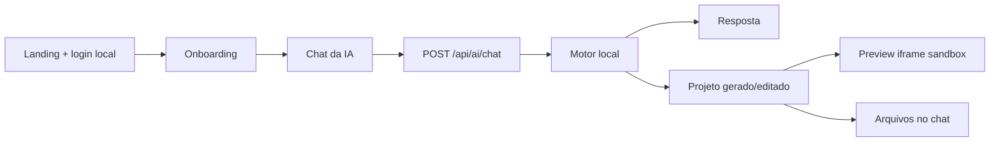

# Arquitetura - ZS Ferramenta

## Fluxo principal

## Pecas principais

- `AiBuilderApp`: controla landing, auth local, onboarding, chat, preview, tokens, planos, configuracoes e conta.
- `respondToBuilderMessage`: interpreta conversa normal, criacao de projeto e edicao do projeto atual.
- `buildProjectFromPrompt`: gera a primeira versao do site/SaaS.
- `POST /api/ai/chat`: contrato principal para chat, criacao e edicao.
- `POST /api/ai/build`: rota preservada para compatibilidade com chamadas antigas.
- `POST /api/billing/mercado-pago`: ponto preparado para criar preferencias reais do Mercado Pago.

## Estado atual

- Autenticacao, perfis salvos, tokens e configuracoes funcionam via `localStorage`.
- Cada conta nova recebe 500 tokens e o reset semanal e calculado no cliente.
- O preview continua isolado com `iframe sandbox`.
- O motor de IA e local e deterministico para manter o deploy funcionando sem API key.

## Para producao real

- Persistir usuarios, projetos, tokens, planos e sessoes em Vercel Postgres, Neon ou Supabase.
- Trocar senha local por auth segura no backend.
- Criar preferencias reais do Mercado Pago usando `MERCADO_PAGO_ACCESS_TOKEN`.
- Conectar um modelo real no Route Handler, mantendo segredos somente no backend.
