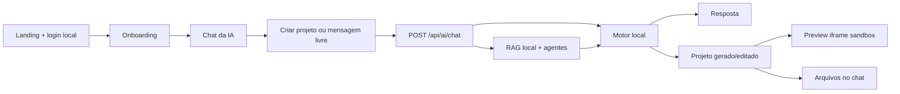

# Arquitetura - ZS Ferramenta

## Fluxo principal

## Pecas principais

- `AiBuilderApp`: controla landing, auth local, onboarding, chat, preview, tokens, planos, configuracoes e conta.
- `CreateProjectModal`: coleta nome da empresa, WhatsApp, email, nicho e cor principal antes de gerar.
- `respondToBuilderMessage`: interpreta conversa normal, criacao de projeto e edicao do projeto atual.
- `buildProjectFromBrief`: gera site a partir do briefing estruturado.
- `buildProjectFromPrompt`: gera a primeira versao do site/SaaS.
- `buildAugmentedPrompt`: junta prompt base, briefing, RAG local e plano multiagente.
- `searchProjectKnowledge`: busca contexto local em documentos, templates, agentes e componentes.
- `POST /api/ai/chat`: contrato principal para chat, criacao e edicao.
- `GET|POST /api/ai/context`: rota de recuperacao contextual local.
- `POST /api/ai/build`: rota preservada para compatibilidade com chamadas antigas.
- `POST /api/billing/mercado-pago`: ponto preparado para criar preferencias reais do Mercado Pago.

## Estado atual

- Autenticacao, perfis salvos, tokens e configuracoes funcionam via `localStorage`.
- Cada conta nova recebe 500 tokens e o reset semanal e calculado no cliente.
- O preview continua isolado com `iframe sandbox`.
- O motor de IA e local e deterministico para manter o deploy funcionando sem API key.
- A geracao de sites usa imagens gratuitas do Unsplash por nicho, com fallback de negocios digitais.
- O RAG inicial usa vetores locais por tokens para recuperar arquitetura, templates, componentes e agentes sem dependencia externa.
- Padarias usam template completo com cabecalho fixo, hero, sobre, produtos, combo, depoimentos, contato e rodape.
- Edicoes de titulo/cor, descricao principal e imagem de produto possuem intencoes especificas no motor local.

## Para producao real

- Persistir usuarios, projetos, tokens, planos e sessoes em Vercel Postgres, Neon ou Supabase.
- Trocar senha local por auth segura no backend.
- Criar preferencias reais do Mercado Pago usando `MERCADO_PAGO_ACCESS_TOKEN`.
- Conectar um modelo real no Route Handler, mantendo segredos somente no backend.
- Trocar RAG local por embeddings reais e armazenamento vetorial persistente.
