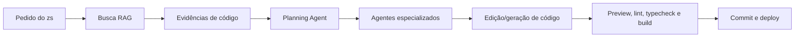

# Arquitetura Da ZS Ferramenta

## Visão Geral

ZS Ferramenta é um cockpit de IA desenvolvedora para criar, editar, analisar e publicar sistemas web. A aplicação une interface de chat, RAG local, memória persistente, agentes especializados e APIs internas.

## Fluxo Principal

## Módulos

- `src/components/zs-platform.tsx`: cockpit visual da plataforma.
- `src/data/platform.ts`: dados de agentes, stack, prompts e roadmap.
- `src/lib/rag/indexer.ts`: varredura segura, chunking e embeddings.
- `src/lib/rag/search.ts`: ranking contextual e recomendações.
- `src/lib/rag/store.ts`: leitura/escrita da memória persistente.
- `src/lib/agents/orchestrator.ts`: plano de execução e agentes.
- `src/app/api/**`: APIs internas para indexação, busca e planejamento.

## Segurança

- Secrets nunca devem ser importados em Client Components.
- Filesystem só roda em Route Handlers com `runtime = "nodejs"`.
- A indexação aceita apenas o workspace atual por padrão.
- Repositórios externos exigem allowlist em `ZS_ALLOWED_INDEX_ROOTS`.
- Arquivos gerados, dependências, caches e locks são ignorados no índice.

## Evolução Recomendada

1. Conector GitHub para listar e clonar repositórios do usuário.
2. Embeddings externos opcionais quando houver chave configurada no backend.
3. Atualização incremental por diff do Git.
4. Preview live com logs e correção automática.
5. Histórico de edições, rollback e deploy Vercel/Railway/Render.
