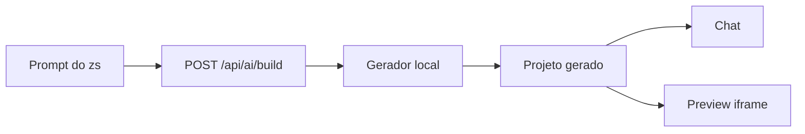

# Arquitetura - ZS Builder

## Fluxo

## Peças principais

- `AiBuilderApp`: controla chat, prompts, preview, exportação e estado de geração.
- `buildProjectFromPrompt`: interpreta o pedido e gera uma primeira versão de SaaS/site.
- `POST /api/ai/build`: camada backend preparada para trocar o gerador local por modelo real.

## Decisão atual

O app usa um motor local determinístico para funcionar sem API key. Isso evita tela quebrada em deploy e mantém o preview útil imediatamente. Quando houver chave/modelo definido, a troca deve acontecer dentro de `src/app/api/ai/build/route.ts`, preservando o contrato de resposta.
